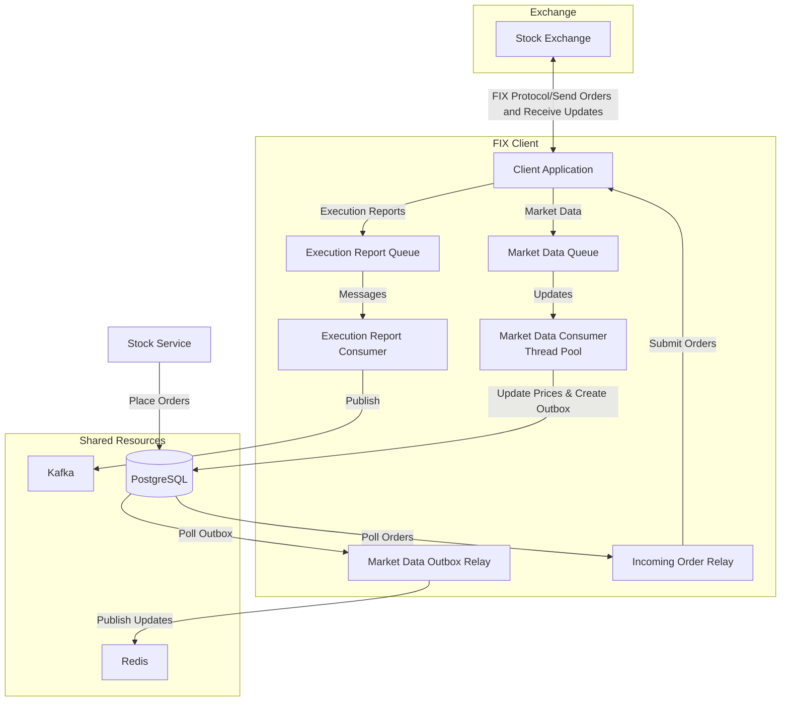

# FIX Client

## Overview

This FIX Client is a high-performance application that serves as a bridge between stock exchanges and internal trading systems using the Financial Information eXchange (FIX) protocol. It processes market data updates from the exchange and handles order submissions.

## Architecture



## Core Components

### 1. Client Application

- Implements the FIX protocol interface using QuickFIX
- Processes incoming FIX messages from stock exchanges
- Routes execution reports and market data updates to appropriate queues

### 2. Execution Report Consumer

- Consumes execution reports from internal queue
- Serializes reports using Protocol Buffers
- Publishes to Kafka for downstream processing
- Single-threaded to maintain order of execution reports

### 3. Market Data Consumer

- Multi-threaded design for high-throughput processing
- Updates stock prices in PostgreSQL database
- Implements transactional outbox pattern for reliable messaging
- Uses timestamp-based conflict resolution

### 4. Incoming Order Relay

- Polls database for new orders
- Transforms orders into FIX protocol messages
- Sends orders to stock exchange
- Manages order state

### 5. Market Data Outbox Relay

- Implements transactional outbox pattern
- Polls outbox table for stock updates
- Serializes updates using Protocol Buffers and publishes them to Redis
- Ensures reliable delivery of market data
- Publishes timeseries data for further analysis

## Performance Considerations

### High Throughput

- Thread pools for parallel market data processing
- Lock-free concurrent queues for inter-thread communication
- Batch database operations
- Bulk message publishing

### Low Latency

- Move semantics to minimize data copying
- Efficient Protocol Buffers serialization
- Direct database connections per thread
- Optimized SQL queries

### Reliability

- Transactional outbox pattern prevents data loss
- Timestamp-based conflict resolution
- Database-backed message queues
- At-least-once delivery guarantees

## Configuration

Configurable via environment variables:

- Kafka settings (batch sizes, compression, retries)
- Redis connection details
- Database connection string
- Processing parameters (thread counts, batch sizes)

## Technical Stack

- **Languages & Standards**: C++23
- **Messaging**: Apache Kafka, Redis
- **Database**: PostgreSQL
- **Libraries**:
  - QuickFIX (FIX protocol)
  - Protocol Buffers (serialization)
  - moodycamel::ConcurrentQueue (lock-free queue)
  - BS::thread_pool (thread management)
  - librdkafka (Kafka client)
  - hiredis (Redis client)
  - libpqxx (PostgreSQL client)

## Building the Project

```bash
mkdir build
cd build
cmake ..
make
```

## Project Structure

```
.
├── include/                 # Header files
├── src/                     # Source files
├── proto/                   # Protocol buffer definitions
├── gen/                     # Generated protobuf code
└── CMakeLists.txt           # Build configuration
```

## Further Required Improvements

- Enhance monitoring and metrics collection
- Add signalling mechanism for managing global boolean values for external management
